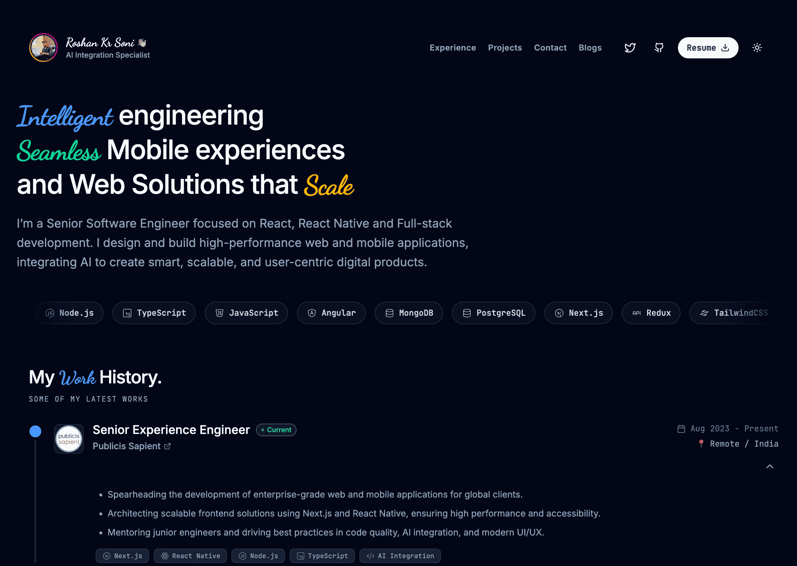

<h1 align="center"><a href="https://roshankrsoni.github.io" target="_blank" style="text-decoration:none; color:inherit;">Roshan Kr Soni - Personal Portfolio</a></h1>
<p align="center">
  <strong>Senior Software Engineer | React & React Native Expert | AI Integration Specialist</strong><br>
  A modern, high-performance portfolio highlighting my experience, projects, and services.
</p>

<p align="center">
   
   
   
   
   
</p>

<div align="center">
  
</div>

<br />
<p align="center">
  <a href="https://roshankrsoni.github.io" target="_blank">
    
  </a>
</p>

## 🚀 Overview

Welcome to my open-source personal portfolio! This repository houses the source code for my professional website, designed to showcase my journey as a Full-Stack developer. 

The website is engineered with a focus on **performance**, **web accessibility**, and **smooth micro-interactions**, serving as both a digital resume and a testament to my technical aesthetics.

## 🛠️ Tech Stack & Architecture

This application leverages a modern web development stack to achieve sub-second load times and a seamless user experience:

- **Frontend Framework**: [React 19](https://react.dev/) + [Vite 6](https://vitejs.dev/) - For lightning-fast rendering and an optimized build process.
- **Styling**: [Tailwind CSS v4](https://tailwindcss.com/) - Utility-first CSS framework for rapid UI development and built-in dark processing.
- **Animations**: [Motion API](https://motion.dev/) - For fluid scroll animations and layout transitions.
- **Icons & Assets**: [Lucide React](https://lucide.dev/) & [React Icons](https://react-icons.github.io/react-icons/)
- **Hosting & CI/CD**: Automated deployment to GitHub Pages.

## 📂 Project Structure

```text
├── src/
│   ├── assets/       # Static local media & branding assets
│   ├── components/   # Modular React components (Hero, Navbar, Experience, etc.)
│   ├── utils/        # Helper functions and global icon mappings
│   ├── App.tsx       # Main page orchestrating the layout
│   └── main.tsx      # React application root entry point
├── old/              # A legacy backup of my original v0 HTML/CSS portfolio site
├── index.html        # HTML template & global metadata/SEO configuration
└── vite.config.ts    # Vite bundler and path configuration
```

## ⚙️ Local Development

Want to run this project locally, experiment with the design, or use it as inspiration? 

1. **Clone the repository:**
   ```bash
   git clone https://github.com/Roshankrsoni/Roshankrsoni.github.io.git
   cd Roshankrsoni.github.io
   ```

2. **Install dependencies:**
   ```bash
   npm install
   ```

3. **Start the development server:**
   ```bash
   npm run dev
   ```
   *The application will boot up and be accessible locally at `http://localhost:3000`.*

4. **Build & Preview for Production:**
   ```bash
   npm run build
   npm run preview
   ```

## 🌐 Deployment Commands

The project utilizes `gh-pages` for seamless deployments straight from your terminal:

```bash
# Automatically builds the production dist/ bundle and pushes to the deployment branch
npm run deploy
```

---

<div align="center">
  <p>If you're interested in collaborating on a project or discussing opportunities, feel free to connect via my portfolio's contact section!</p>
  <i>Built with ❤️ by Roshan Kr Soni.</i>
</div>
