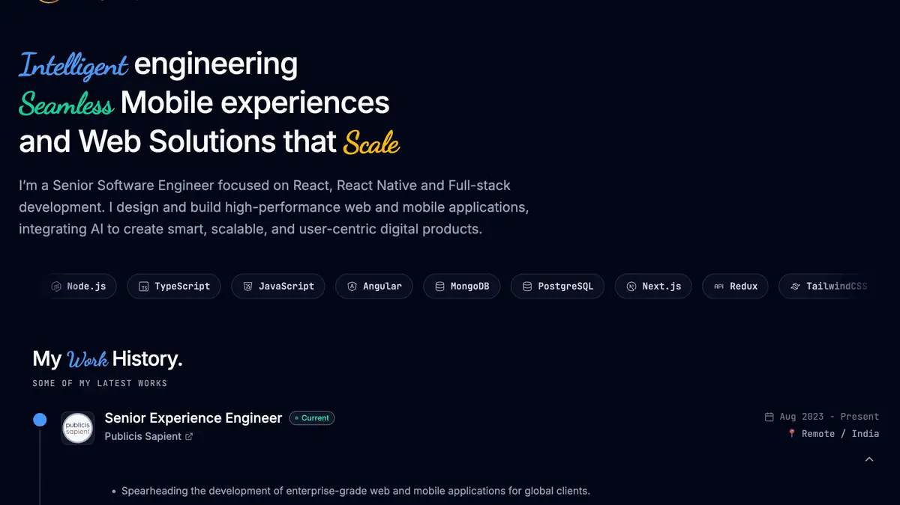

<div align="center">
  
  
  <br /><br />

  <h1 align="center"><a href="https://roshankrsoni.github.io" target="_blank" style="text-decoration:none; color:inherit;">Roshan Kr Soni - Personal Portfolio</a></h1>
  
  <p align="center">
    <strong>Senior Software Engineer | React & React Native | AI Integration</strong><br>
    My personal portfolio built to showcase my work, experience, and general coding aesthetic.
  </p>

  <p align="center">
    <a href="https://roshankrsoni.github.io" target="_blank">
      
    </a>
  </p>

  <p align="center">
     
     
     
     
  </p>
</div>

---

## 👋 Hey there!

Welcome to the repo for my personal website. I built this to serve as my digital resume, focusing heavily on clean design, fast load times, and good accessibility. 

The site natively supports system-based Dark and Light modes, fluid scroll animations, and responsive layouts for mobile viewing.

---

## ⚡ Performance

The site is tuned for a fast, accessible first paint:

- **Self-hosted, subsetted fonts** (`public/fonts/*.woff2`) — no third-party font origin, 43 kB total instead of 124 kB from Google Fonts.
- **CSS is inlined into `index.html`** at build time, so there are zero render-blocking subresources.
- **Above-the-fold animations are pure CSS** (transform/opacity only), so first paint never waits on JavaScript.
- **Below-the-fold sections are code-split** and fetched on scroll/anchor intent, keeping `motion` and the section bundles off the critical path.
- **Mixpanel is loaded on engagement** (first scroll/click/keypress) rather than at startup.
- **Images are WebP with `srcset`/`sizes`** and explicit `width`/`height` to avoid layout shift.

Run `./lh.sh [label] mobile|desktop` to reproduce a Lighthouse run against `vite preview`.

### Hosting and cache headers

`public/_headers`, `netlify.toml`, and `vercel.json` all ship the same policy: `Cache-Control: public, max-age=31536000, immutable` for `/assets/*` and `/fonts/*`, plus CSP, HSTS, COOP, `X-Frame-Options`, `nosniff`, `Referrer-Policy`, and `Permissions-Policy`.

> **Note:** GitHub Pages hard-codes `Cache-Control: max-age=600` and does not allow custom response headers, so the long-lived cache and security headers only take effect when the built `dist/` is served from Cloudflare Pages, Netlify, or Vercel. On GitHub Pages the build falls back to the inline `<meta http-equiv="Content-Security-Policy">` policy in `index.html`.

---

## 🛠️ Built With

Nothing crazy—just solid modern tools:
- **React 19 & Vite 6** - For the core engine and lightning-fast builds.
- **Tailwind CSS v4** - Makes styling the dark mode and responsive layouts a breeze.
- **Motion API** - For all the slick micro-animations.
- **Lucide & React Icons**

---

## 🏃‍♂️ Running it locally

If you want to spin this up on your own machine to poke around the code:

```bash
# Clone the repository
git clone https://github.com/Roshankrsoni/Roshankrsoni.github.io.git
cd Roshankrsoni.github.io

# Install deps
npm install

# Start the dev server
npm run dev
```

To build and deploy to GitHub Pages, I just use:
```bash
npm run deploy
```

---

## ✌️ Feel free to use it!

This code is open-sourced, so you're totally welcome to use it as a template for your own portfolio. 

All I ask is that you swap out my personal details and give me a quick credit somewhere (like your footer or README).

<br />
<div align="center">
  <i>Built with ❤️ by Roshan Kr Soni.</i>
</div>
