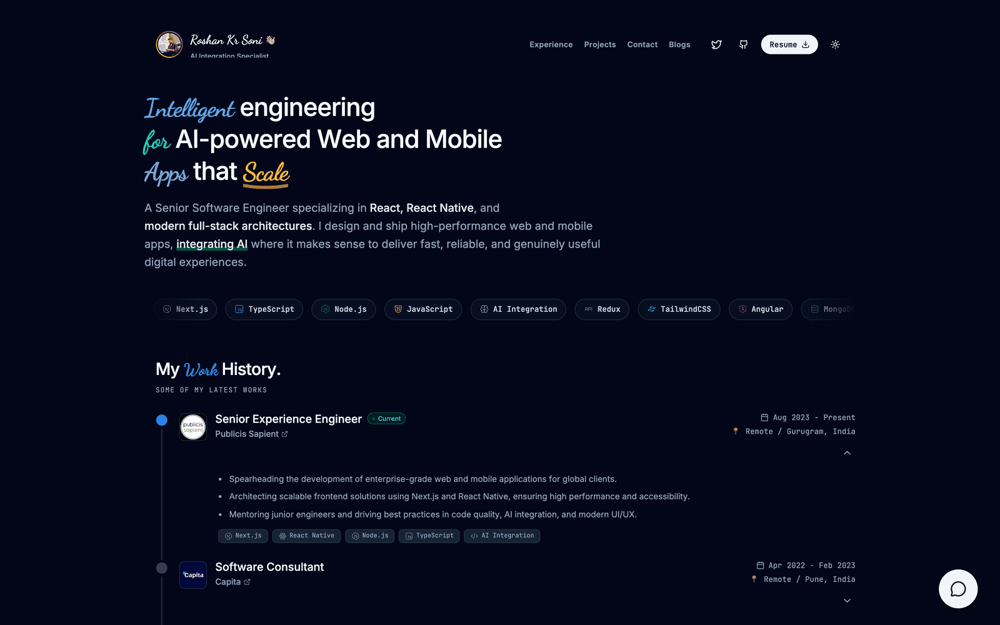
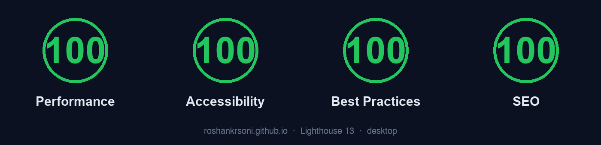

<div align="center">
  <picture>
    <source srcset="docs/portfolio-hero.webp" type="image/webp" />
    
  </picture>

  <br /><br />

  <h1 align="center"><a href="https://roshankrsoni.github.io" target="_blank" style="text-decoration:none; color:inherit;">Roshan Kr Soni — Personal Portfolio</a></h1>

  <p align="center">
    <strong>Senior Software Engineer | React & React Native | AI Integration</strong><br>
    My personal portfolio, built to showcase my work, experience, and general coding aesthetic.
  </p>

  <p align="center">
    <a href="https://roshankrsoni.github.io" target="_blank">
      
    </a>
  </p>

  <p align="center">
    
    
    
    
  </p>
</div>

---

## 👋 Hey there!

Welcome to the repo for my personal website. I built this to serve as my digital
resume, focusing on clean design, fast load times, and good accessibility.

It natively supports system dark and light modes, fluid scroll animations, and
responsive layouts down to small mobile viewports. Every section renders in the
first paint — nothing is stubbed out and loaded in later — so scrolling never
shows an empty placeholder.

---

## ⚡ Performance



Audited with **Lighthouse 13** against the deployed site.

| | Performance | Accessibility | Best Practices | SEO |
| :-- | :--: | :--: | :--: | :--: |
| **Desktop** | 100 | 100 | 100 | 100 |
| **Mobile** | 99 | 100 | 100 | 100 |

Measured metrics on mobile (simulated Moto G, slow 4G): **FCP 1.4 s**,
**LCP 1.9 s**, **TBT 0 ms**, **CLS 0**. The first load is 9 requests / 91 kB,
down from 25 requests / 619 kB.

### How

- **CSS is inlined into `index.html` at build time** by a small Vite plugin, so
  the page has zero render-blocking subresources. The stylesheet was costing
  454 ms of wasted load time.
- **Fonts are self-hosted and subsetted** — `public/fonts/*.woff2`, 43 kB total
  versus 124 kB from Google Fonts, with no third-party origin, no DNS/TLS
  handshake, and a 1-year immutable cache.
- **Above-the-fold animations are plain CSS** (`transform` only). LCP is text, so
  gating it behind a JS-driven `opacity: 0 → 1` fade cost ~850 ms of render
  delay. No text in this site ever animates its own opacity, which would also
  drop it below the WCAG AA contrast threshold mid-animation.
- **All sections render up front.** Deferring them with code splitting was tried
  and reverted: it removed content from the DOM, reserved a viewport of empty
  space, and bought a Lighthouse point that was never worth a broken first
  impression.
- **Mixpanel loads on engagement** (first scroll, click, or keypress) instead of
  at startup, and session recording is off. That removes 422 kB of raw JS and
  ~433 ms of main-thread work from the critical path.
- **Images are WebP with `srcset`/`sizes`** and explicit `width`/`height` to
  avoid layout shift. The 40×40 company logos went from 48 kB to 2.4 kB, and the
  navbar avatar from 48 kB to 3 kB.
- **No third-party embed** — the old hit-counter widget went away, since it
  rendered without dimensions and caused CLS.
- **Modern build target** — `es2022`, no module preload polyfill, no Babel.

### Accessibility

Semantic landmarks, labelled controls, visible focus states, and a
`prefers-reduced-motion` fallback. The blog card links are named with
`aria-labelledby` so their accessible name keeps the visible title.

---

## 🛠️ Built With

Nothing crazy — just solid modern tools:

- **React 19 & Vite 6** — the core engine and the build.
- **Tailwind CSS v4** — styling, dark mode, and responsive layout.
- **Motion API** — scroll reveals and micro-interactions.
- **Lucide & React Icons** — iconography.
- **gh-pages** — publishing to GitHub Pages.

### Repo layout

```
assets/   images imported by the app (bundled + hashed)
public/   static files copied verbatim into dist/ (self-hosted fonts, favicon)
docs/     README images only — never part of the build
src/      application source
```

`docs/` is referenced only by this README. It is not inside `public/`, so Vite
never copies it and it can never reach `dist/`.

---

## 🏃‍♂️ Running it locally

```bash
# clone
git clone https://github.com/Roshankrsoni/Roshankrsoni.git
cd Roshankrsoni.github.io

# install
npm install

# dev server on http://localhost:3000
npm run dev
```

Other scripts:

```bash
npm run build     # production build into dist/
npm run preview   # serve the production build locally
npm run lint      # tsc --noEmit
npm run deploy    # publish dist/ to the gh-pages branch
```

`./lh.sh [label] mobile|desktop` builds, previews, and runs a Lighthouse audit
against `localhost:4173`, printing the four category scores. Handy for checking a
change before you push.

### Hosting and cache headers

`public/_headers`, `netlify.toml`, and `vercel.json` all ship the same policy:
`Cache-Control: public, max-age=31536000, immutable` for `/assets/*` and
`/fonts/*`, plus CSP, HSTS, COOP, CORP, `X-Frame-Options`, `nosniff`,
`Referrer-Policy`, and `Permissions-Policy`.

> **Note:** GitHub Pages hard-codes `Cache-Control: max-age=600` and offers no
> way to set response headers, so on GitHub Pages the long-lived cache and the
> header-based security policy do not apply. There, the build falls back to the
> inline `<meta http-equiv="Content-Security-Policy">` in `index.html`. Serve
> `dist/` from Cloudflare Pages, Netlify, or Vercel to get the rest.

---

## ✌️ Feel free to use it!

This code is open-sourced, so you're welcome to use it as a starting point for
your own portfolio.

All I ask is that you swap out my personal details and give me a quick credit
somewhere (like your footer or this README).

<br />
<div align="center">
  <i>Built with ❤️ by <a href="https://www.linkedin.com/in/roshankrsoni/">Roshan Kr Soni</a>.</i>
</div>
